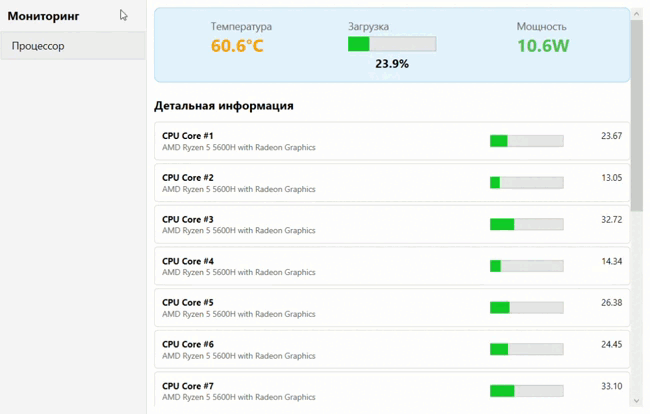

# Vitals

Vitals - это desktop-приложение для мониторинга основных компонентов компьютера в реальном времени. Приложение предоставляет подробную информацию о работе системы.

Проект активно развивается и будет дополняться новым функционалом

## Скриншоты

## Функциональные возможности

### Реализовано

- Мониторинг процессора в реальном времени:
  - Загрузка ядер и общая загрузка
  - Температура
  - Потребляемая мощность
  - Детальная информация по всем датчикам
- Современный WPF-интерфейс
- Автоматическое обновление данных каждую секунду
- Запрос прав администратора для доступа к датчикам

### Планируется к реализации

- Мониторинг видеокарты
- Мониторинг оперативной памяти
- Мониторинг накопителей
- Мониторинг сетевой активности
- Графики и история показателей

## Технологии

### Основной стек:

- С#
- WPF
- Архитектурный паттерн MVVM
- CommunityToolkit.Mvvm для реализации архитектурного паттерна
- Dependency Injection для внедрения зависимостей
- Microsoft.Extensions.Hosting для управления жизненным циклом приложения

### Библиотеки мониторинга

- **LibreHardwareMonitorLib** [LibreHardwareMonitorLib](https://github.com/LibreHardwareMonitor/LibreHardwareMonitor)

Особая благодарность авторам данной библиотеки.

## Запуск с правами администратора

Приложение автоматически запросит права администратора при запуске. Это необходимо для доступа к датчикам температуры и мощности.

## Контакты

Если у вас есть вопросы или предложения, свяжитесь со мной:

- **Email:** dev.assist@yandex.ru
- **GitHub:** [CurvaRivazza](https://github.com/CurvaRivazza)

## Лицензия

Этот проект лицензирован под [MIT License](LICENSE)
